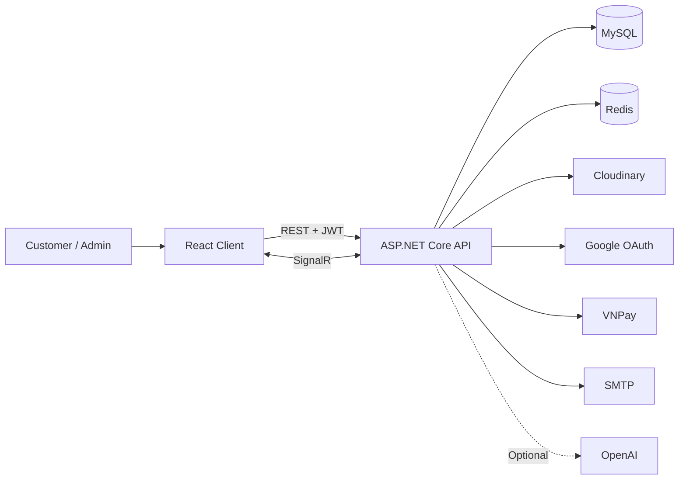

# HauShop

[](https://github.com/Son2k5/HauShop/actions/workflows/ci.yml)


HauShop is a full-stack fashion e-commerce platform built with React and ASP.NET Core. It provides a modern storefront, secure authentication, VNPay checkout, real-time notifications, customer support chat, Cloudinary media management, and a complete administration experience.

## Project Screenshots


## Main Features

- User registration, login, JWT refresh, password recovery, and Google OAuth
- Product listing, search, filtering, category browsing, and product details
- Shopping cart, wishlist, checkout, and VNPay payment integration
- Order management, status tracking, cancellations, and product reviews
- Cloudinary product image and avatar upload
- Real-time notifications and support chat using SignalR
- Optional AI-assisted chat
- Admin dashboard with product, category, inventory, order, and user management

## Tech Stack

| Area | Technologies |
| --- | --- |
| Frontend | React 19, TypeScript 5.9, Vite 6, Tailwind CSS, React Router, TanStack Query, Axios, Framer Motion |
| Backend | ASP.NET Core Web API 9, Entity Framework Core 9, FluentValidation, AutoMapper, SignalR |
| Authentication | JWT, refresh tokens, Google OAuth |
| Data | MySQL 8.4, Redis 7.4 |
| Integrations | VNPay, Cloudinary, MailKit/SMTP, optional OpenAI chat |
| Testing and CI | xUnit, GitHub Actions |
| Deployment | Docker Compose, Nginx, Vercel |

## System Architecture



The API follows a controller-service-repository structure. MySQL stores application data, Redis supports caching, token state, events, and login rate limiting, while SignalR delivers real-time chat and notifications.

## Overall Project Structure

```text
.
|-- api/                         # ASP.NET Core Web API
|   |-- controllers/             # REST endpoints
|   |-- services/                # Business logic
|   |-- repositories/            # Data access
|   |-- data/seed/               # Catalog, customer, and order seed data
|   `-- Migrations/              # EF Core migrations
|-- frontend/                    # React TypeScript client
|   |-- src/components/          # Reusable UI components
|   |-- src/pages/               # Storefront and admin pages
|   |-- src/services/            # API service modules
|   `-- src/assets/images/       # UI and product assets
|-- tests/api.Tests/             # Backend xUnit tests
|-- infra/                       # Nginx and Redis configuration
|-- .env.example                 # Local API and Docker environment template
|-- .env.production.example      # Production environment template
|-- docker-compose.yml           # Local development stack
|-- docker-compose.prod.yml      # Production deployment stack
`-- HauShop.sln                  # .NET solution
```

## Required Tools

- [Git](https://git-scm.com/) or a ZIP extraction tool
- [.NET SDK 9](https://dotnet.microsoft.com/download/dotnet/9.0)
- [Node.js 22](https://nodejs.org/) and npm
- [Docker Desktop](https://www.docker.com/products/docker-desktop/) with Docker Compose
- EF Core CLI: `dotnet-ef`
- Google OAuth, Cloudinary, VNPay, and SMTP credentials for their related features

MySQL and Redis can be installed manually, but Docker Compose is the recommended local setup.

## Environment Variable Setup

The source code folder includes the following safe templates:

- `.env.example`: local API and Docker Compose configuration
- `frontend/.env.example`: manual Vite frontend configuration
- `.env.production.example`: production deployment configuration

Create local configuration files from the templates:

```bash
cp .env.example .env
cp frontend/.env.example frontend/.env
```

Windows PowerShell equivalent:

```powershell
Copy-Item .env.example .env
Copy-Item frontend/.env.example frontend/.env
```

At minimum, configure these values in the root `.env`:

| Group | Required or important variables |
| --- | --- |
| Database and Redis | `ConnectionStrings__DefaultConnection`, `MYSQL_ROOT_PASSWORD`, `MYSQL_PASSWORD`, `REDIS_PASSWORD`, `Redis__Configuration` |
| Authentication | `Jwt__Key`, `Google__ClientId`, `Google__ClientSecret`, `Cors__AllowedOrigins__*` |
| Cloudinary | `CloudinarySettings__CloudName`, `CloudinarySettings__ApiKey`, `CloudinarySettings__ApiSecret` |
| Payments and email | `VnPay__TmnCode`, `VnPay__HashSecret`, `EmailSettings__*` |
| Local HTTPS | `ASPNETCORE_Kestrel__Certificates__Default__Password` |

Example host connections when MySQL and Redis run through local Docker:

```dotenv
ConnectionStrings__DefaultConnection=Server=localhost;Port=3306;Database=haushop;User=haushop;Password=your-mysql-password;
Redis__Configuration=localhost:6379,password=your-redis-password,abortConnect=false
```

Keep `.env.example` inside the submitted source folder. Do not include or commit real `.env`, `.env.production`, certificates, or secrets.

## Installation

```bash
git clone https://github.com/Son2k5/HauShop.git
cd HauShop
dotnet restore HauShop.sln
cd frontend
npm install
cd ..
dotnet tool install --global dotnet-ef --version "9.*"
```

If `dotnet-ef` is already installed, update it with:

```bash
dotnet tool update --global dotnet-ef --version "9.*"
```

## Run Frontend

Ensure `frontend/.env` exists and points to the running API:

```bash
cd frontend
npm install
npm run dev
```

The frontend runs at `https://localhost:3000`. Use `npm ci` instead of `npm install` for a clean, lockfile-exact installation.

## Run Backend

Start MySQL and Redis, apply migrations, then run the API:

```bash
docker compose up -d mysql redis
dotnet restore HauShop.sln
dotnet ef database update --project api/api.csproj --startup-project api/api.csproj
dotnet run --project api/api.csproj --launch-profile https
```

The API runs at `https://localhost:7288`, with Swagger at `https://localhost:7288/swagger`.

## Database Migration and Seed

Migrations are not applied automatically unless `Database__ApplyMigrationsOnStartup=true`.

Create a migration after changing the entity model:

```bash
dotnet ef migrations add YourMigrationName --project api/api.csproj --startup-project api/api.csproj
```

Apply all pending migrations:

```bash
dotnet ef database update --project api/api.csproj --startup-project api/api.csproj
```

`Add-Migration` and `Update-Database` are Visual Studio Package Manager Console commands. Their .NET CLI equivalents are `dotnet ef migrations add` and `dotnet ef database update`.

### Seed Sample Data

The seed endpoints create categories, brands, products, variants, 40 customer accounts, addresses, and sample orders. They require an authenticated Admin account.

1. Register a normal account through the application.
2. Promote that account to Admin in MySQL because no default Admin credential is committed:

```bash
docker exec -it haushop-mysql mysql -uhaushop -p haushop
```

```sql
UPDATE Users SET Role = 0 WHERE Email = 'your-email@example.com';
```

3. Sign out and sign in again so the new Admin role is included in the session.
4. Open Swagger and execute `POST /api/seed/run`.

Available seed endpoints:

| Endpoint | Purpose |
| --- | --- |
| `POST /api/seed/run` | Seed catalog, customers, and orders |
| `POST /api/seed/orders/run` | Seed customer order data |
| `DELETE /api/seed/orders/clear` | Remove seeded customer orders |
| `POST /api/seed/reset` | Clear and recreate all seed data |

## Run the Full System from a Clean Machine

1. Install Git, Docker Desktop, .NET SDK 9, and Node.js 22.
2. Clone or extract the source folder and confirm `.env.example` and `frontend/.env.example` are present.
3. Copy both example files to `.env` and `frontend/.env`, then fill all required values.
4. Create the local HTTPS certificate and use the same password in the root `.env`:

```bash
mkdir -p api/certs
dotnet dev-certs https -ep api/certs/aspnetapp.pfx -p your-certificate-password
```

Windows PowerShell directory command:

```powershell
New-Item -ItemType Directory -Force api/certs
dotnet dev-certs https -ep api/certs/aspnetapp.pfx -p your-certificate-password
```

5. Start infrastructure and prepare the database:

```bash
docker compose up -d mysql redis
dotnet restore HauShop.sln
dotnet tool install --global dotnet-ef --version "9.*"
dotnet ef database update --project api/api.csproj --startup-project api/api.csproj
```

6. Build and start the full Docker stack:

```bash
docker compose up -d --build api frontend
```

7. Open the services:

| Service | URL |
| --- | --- |
| Storefront | `http://localhost:5173` |
| API | `https://localhost:7288` or `http://localhost:8080` |
| Swagger UI | `https://localhost:7288/swagger` |
| Health checks | `https://localhost:7288/health` and `https://localhost:7288/health/redis` |

Use `docker compose down` to stop the system.

## Upload Product Images to Cloudinary

First, set the three `CloudinarySettings__*` values from your Cloudinary dashboard in the root `.env`, then restart the API.

### Using the Admin UI

1. Sign in with an Admin account.
2. Open `/admin/media` to upload multiple images, or `/admin/products` to upload an image while creating or editing a product.
3. Use the returned secure URL as the product `imageUrl`.
4. Use the returned Cloudinary Public ID as the product `imageKey`.
5. Save the product.

Uploaded product images are stored under the Cloudinary folder `haushop/product`.
If the product form does not automatically populate these fields, use Swagger or the API method below and paste the returned `url` and `publicId` manually.

### Using the API

Upload one or more `.jpg`, `.jpeg`, `.png`, `.webp`, or `.gif` files:

```bash
curl -k -X POST "https://localhost:7288/api/image/upload" \
  -F "files=@path/to/product-image.webp"
```

From the response, copy `uploaded[0].url` to `imageUrl` and `uploaded[0].publicId` to `imageKey`, then create or update the product through the Admin UI or an authorized product endpoint.

Example image fields:

```json
{
  "imageUrl": "https://res.cloudinary.com/your-cloud/image/upload/haushop/product/product-image.webp",
  "imageKey": "haushop/product/product-image"
}
```

Delete an unused Cloudinary image with:

```bash
curl -k -X DELETE "https://localhost:7288/api/image/delete?publicId=haushop/product/product-image"
```

## Demo Accounts

After `POST /api/seed/run` completes, the following Member account is available:

| Role | Email | Password |
| --- | --- | --- |
| Member | `khachhang01@seed.haushop.vn` | `Customer@123` |

The seed creates `khachhang01@seed.haushop.vn` through `khachhang40@seed.haushop.vn` with the same password. No default Admin account or Admin password is committed.

## API Documentation

Swagger is available only in the Development environment:

- Swagger UI: `https://localhost:7288/swagger`
- OpenAPI JSON: `https://localhost:7288/swagger/v1/swagger.json`
- API base path: `/api`
- SignalR hubs: `/hubs/chat` and `/hubs/notifications`

## Tests and Quality Checks

```bash
dotnet build HauShop.sln --configuration Release
dotnet test HauShop.sln --configuration Release
cd frontend
npm run lint
npm run build
```

## Known Issues and Setup Notes

- No Admin demo account is included; an account must be promoted before calling Admin-only seed endpoints.
- Database migrations are disabled on startup by default and must be applied manually.
- Local Docker HTTPS requires `api/certs/aspnetapp.pfx` and its matching password.
- Swagger is disabled outside the Development environment.
- VNPay, Google OAuth, Cloudinary, SMTP, and AI chat require valid external service credentials.
- Product images use their base filename as the Cloudinary Public ID; uploading the same filename overwrites the existing asset.
- The frontend upload helper currently expects URL strings while the API returns upload result objects; use the API response's `url` and `publicId` fields manually if the Admin product form does not populate them.

## Deployment Notes

The configured production architecture serves the frontend from Vercel and the API from a VPS:

- Frontend: `https://haushop.io.vn`
- API: `https://api.haushop.io.vn`

```bash
cp .env.production.example .env.production
docker compose --env-file .env.production -f docker-compose.prod.yml up -d --build
```

Configure Vercel with `frontend` as the project root, `npm run build` as the build command, and `dist` as the output directory. The VPS Nginx template is available at `infra/nginx/api.haushop.io.vn.conf`.
